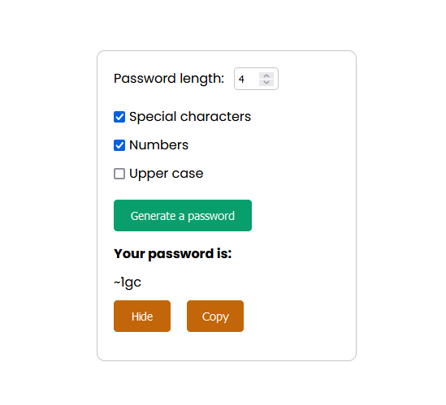

# Password generator

Password generator project was created with Vite+React.

## Live

<a href = 'passgenerator-react.netlify.app/'>passgenerator-react.netlify.app/</a>

## Technologies

## About the project

This application is used to generate a password. The user can enter a password length and choose whether the password should contain special characters, digits or capital letters. By default, the generated password consists of lower case letters only.

The generated password can be copied or hidden for security purposes.

## Screenshot

  

  
  

